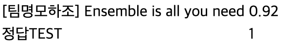

# AIFFEL-DLthon

## 팀이름

팀명모하조

## 결과

 

## 일정

1일차

- 일반 대화 데이터 세트 추가
- 데이터 전처리 후 시간이 남으면 모델 만들어 적용해 보기 (GPT 사용?)
- 데이터 전처리에 관한 논의 및 시행착오
- 어떤 모델을 써볼지, 어떤 식으로 조정을 해볼지에 대한 논의 진행

2일차
- 문제점 인지 
- 일반 대화가 불필요하다는 것을 인지 
- 데이터 전처리 후 모델 작성 및 실험 시작 (KoBERT) 
- 성능 미달로 다른 모델 작성 및 실험 시작 (KoBERT-KoELECTRA Ensemble) 
- 추가 성능 개선 위해 다른 모델 작성 및 실험 시작 (KoELECTRA-KLUE BERT)
- 시행착오를 거치며 목표 설정 및 다양한 모델로 실험 진행 (목표: 리더보드 1위-달성)
- 목표 달성 완료

-목: 발표

## 실험 내역

| DataSet                  | Batch | Epoch | Score | 비고   |
| ------------------------ | ----- | ----- | ----- | ------ |
| kokoensemble             | 256   | 4     | 2     | 0.875  |
| kokoensemble             | 256   | 4     | 3     | 0.8925 |
| kokoensemble             | 256   | 4     | 4     | 0.88   |
| kokoensemble             | 512   | 4     | 3     | 0.8675 |
| kokoensemble             | 512   | 4     | 4     | 0.885  |
| kokoensemble             | 512   | 4     | 5     | 0.8825 |
| kokoensemble             | 256   | 16    | 3     | 0.8775 |
| kokoensemble             | 256   | 4     | 3     | 0.575  |
| kokoensemble             | 256   | 4     | 3     | 0.8575 |
| kokoensemble             | 288   | 4     | 1     | 0.8425 |
| kokoensemble             | 288   | 4     | 2     | 0.885  |
| kokoensemble             | 288   | 4     | 3     | 0.87   |
| kokoensemble             | 288   | 4     | 4     | 0.895  |
| kokoensemble             | 288   | 4     | 5     | 0.89   |
| kokoensemble             | 288   | 4     | 6     | 0.8975 |
| kokoensemble             | 320   | 4     | 6     | 0.875  |
| kokoensemble             | 350   | 4     | 1     | 0.8375 |
| kokoensemble             | 350   | 4     | 2     | 0.88   |
| kokoensemble             | 350   | 4     | 3     | 0.8925 |
| kokoensemble             | 350   | 4     | 4     | 0.9025 |
| kokoensemble             | 350   | 4     | 5     | 0.9    |
| kokoensemble             | 256   | 8     | 3     | 0.88   |
| kokoensemble             | 350   | 4     | 2     | 0.8725 |
| kokoensemble             | 350   | 4     | 2     | 0.8675 |
| kokoensemble             | 350   | 4     | 5     | 0.8675 |
| kokoensemble             | 350   | 4     | 1     | 0.8725 |
| kokoensemble             | 350   | 4     | 2     | 0.9025 |
| kokoensemble             | 350   | 4     | 3     | 0.8925 |
| kokoensemble             | 350   | 4     | 4     | 0.8825 |
| Ko-ELECTRA               | 350   | 4     | 3     | 0.905  |
| Ko-ELECTRA               | 350   | 4     | 4     | 0.91   |
| Ko-ELECTRA               | 350   | 4     | 5     | 0.895  |
| Ko-ELECTRA               | 350   | 4     | 2     | 0.865  |
| Ko-ELECTRA               | 350   | 4     | 5     | 0.895  |
| Ko-ELECTRA               | 350   | 4     | 1     | 0.835  |
| Ko-ELECTRA               | 350   | 4     | 2     | 0.8825 |
| Ko-ELECTRA               | 350   | 4     | 3     | 0.87   |
| Ko-ELECTRA               | 350   | 4     | 4     | 0.8725 |
| Ko-ELECTRA               | 350   | 4     | 4     | 0.89   |
| Ko-ELECTRA               | 350   | 4     | 4     | 0.8825 |
| Ko-ELECTRA               | 350   | 4     | 4     | 0.8925 |
| Ko-ELECTRA               | 350   | 4     | 4     | 0.9025 |
| Ko-ELECTRA               | 350   | 4     | 4     | 0.8675 |
| Ko-ELECTRA               | 350   | 4     | 4     | 0.9125 |
| Ko-ELECTRA               | 350   | 4(2)  | 4     | 0.9    |
| Ko-ELECTRA               | 350   | 4     | 4     | 0.8875 |
| Ko-ELECTRA               | 350   | 2     | 4     | 0.8925 |
| Ko-ELECTRA               | 350   | 4     | 4     | 0.9    |
| Ko-ELECTRA               | 350   | 4     | 4     | 0.86   |
| Ko-ELECTRA               | 350   | 4     | 4     | 0.9125 |
| Ko-ELECTRA               | 350   | 4     | 4     | 0.9025 |
| Ko-ELECTRA               | 350   | 4     | 4     | 0.8975 |
| Ko-ELECTRA               | 350   | 4     | 4     | 0.8975 |
| Ko-ELECTRA               | 350   | 4     | 4     | 0.9    |
| Ko-ELECTRA               | 350   | 4     | 4     | 0.9025 |
| Ko-ELECTRA               | 350   | 4     | 4     | 0.905  |
| Ko-ELECTRA               | 350   | 4     | 4     | 0.905  |
| Ko-ELECTRA               | 350   | 4     | 4     | 0.9    |
| Ko-ELECTRA               | 350   | 4     | 4     | 0.9    |
| Ko-ELECTRA               | 350   | 4     | 4     | 0.9    |
| Ko-ELECTRA               | 350   | 4     | 4     | 0.8975 |
| Ko-ELECTRA               | 350   | 4     | 4     | 0.8975 |
| Ko-ELECTRA               | 350   | 4     | 4     | 0.905  |
| Ko-ELECTRA               | 350   | 4     | 4     | 0.8925 |
| Ko-ELECTRA               | 350   | 4     | 4     | 0.9025 |
| Ko-ELECTRA               | 350   | 4     | 4     | 0.8975 |
| Ko-ELECTRA               | 350   | 4     | 4     | 0.9    |
| Ko-ELECTRA               | 350   | 4     | 4     | 0.9025 |
| Ko-ELECTRA               | 350   | 4     | 4     | 0.9    |
| Ko-ELECTRA               | 350   | 4     | 4     | 0.905  |
| Ko-ELECTRA               | 350   | 4     | 4     | 0.9    |
| Ko-ELECTRA               | 512   | 8     | 3     | 0.8875 |
| Ko-ELECTRA               | 512   | 8     | 4     | 0.885  |
| Ko-ELECTRA               | 512   | 8     | 2     | 0.855  |
| Ko-ELECTRA               | 288   | 4     | 1     | 0.84   |
| Ko-ELECTRA               | 288   | 4     | 2     | 0.87   |
| Ko-ELECTRA               | 288   | 4     | 3     | 0.87   |
| Ko-ELECTRA               | 288   | 4     | 4     | 0.8925 |
| Ko-ELECTRA               | 288   | 4     | 5     | 0.8975 |
| Ko-ELECTRA               | 288   | 4     | 6     | 0.8925 |
| Ko-ELECTRA               | 320   | 4     | 6     | 0.875  |
| Ko-BERT                  | 512   | 16    | 3     | 0.6225 |
| Ko-BERT                  | 256   | 16    | 3     | 0.585  |
| Ko-BERT                  | 512   | 8     | 2     | 0.5625 |
| Ko-BERT                  | 512   | 8     | 4     | 0.5975 |
| Ko-BERT                  | 512   | 8     | 5     | 0.6175 |
| Ko-BERT                  | 128   | 4     | 3     | 0.6325 |
| Ko-BERT                  | 64    | 4     | 3     | 0.5825 |
| Ko-BERT                  | 350   | 4     | 3     | 0.63   |
| Ko-BERT                  | 350   | 4     | 4     | 0.625  |
| Ko-BERT                  | 350   | 4     | 5     | 0.6175 |
| Ko-BERT                  | 350   | 4     | 2     | 0.6175 |
| Ko-BERT                  | 350   | 4     | 5     | 0.605  |
| Ko-BERT                  | 512   | 8     | 1     | 0.3975 |
| Ko-BERT                  | 512   | 8     | 2     | 0.5375 |
| Ko-BERT                  | 512   | 8     | 3     | 0.6125 |
| Ko-BERT                  | 512   | 8     | 6     | 0.6625 |
| Ko-BERT                  | 512   | 8     | 10    | 0.5975 |
| Ko-BERT                  | 512   | 8     | 3     | 0.5775 |
| Ko-BERT                  | 512   | 8     | 6     | 0.625  |
| Ko-BERT                  | 128   | 16    | 3     | 0.555  |
| Ko-BERT                  | 256   | 16    | 3     | 0.59   |
| Ko-BERT                  | 288   | 4     | 1     | 0.535  |
| Ko-BERT                  | 288   | 4     | 2     | 0.5425 |
| Ko-BERT                  | 288   | 4     | 3     | 0.5525 |
| Ko-BERT                  | 288   | 4     | 4     | 0.615  |
| Ko-BERT                  | 288   | 4     | 5     | 0.615  |
| Ko-BERT                  | 288   | 4     | 6     | 0.625  |
| Ko-BERT                  | 320   | 4     | 6     | 0.555  |
| klue                     | 350   | 4     | 1     | 0.8825 |
| klue                     | 350   | 4     | 2     | 0.9    |
| klue                     | 350   | 4     | 3     | 0.8975 |
| klue                     | 350   | 4     | 4     | 0.8875 |
| funnel-transformer-kor   | 350   | 4     | 1     | 0.875  |
| funnel-transformer-kor   | 350   | 4     | 2     | 0.8875 |
| funnel-transformer-kor   | 350   | 4     | 3     | 0.8825 |
| funnel-transformer-kor   | 350   | 4     | 4     | 0.8725 |
| funnel-transformer-kor   | 350   | 4     | 2     | 0.8925 |
| funnel-transformer-kor   | 350   | 4     | 2     | 0.9075 |
| Ensemble is all you need |       |       |       | 0.92   |

## 참고 자료

-전기수 해커톤: https://github.com/sda96/AIFFEL_3rd_hackerton_TUNiB_DKTC \
-AwesomeKorean_Data: https://github.com/songys/AwesomeKorean_Data \
-한국어 SNS: https://aihub.or.kr/aihubdata/data/view.do?currMenu=115&topMenu=100&aihubDataSe=realm&dataSetSn=114 \
-한국어 대화 요약: https://aihub.or.kr/aihubdata/data/view.do?currMenu=115&topMenu=100&aihubDataSe=realm&dataSetSn=117 \
-감성 대화 말뭉치: https://aihub.or.kr/aihubdata/data/view.do?currMenu=115&topMenu=100&aihubDataSe=realm&dataSetSn=86 \
-텍스트 윤리검증 데이터: https://aihub.or.kr/aihubdata/data/view.do?currMenu=115&topMenu=100&aihubDataSe=realm&dataSetSn=558 \
-koBERT: https://github.com/SKTBrain/KoBERT \
-koELECTRA: https://github.com/monologg/KoELECTRA/blob/master/README.md
